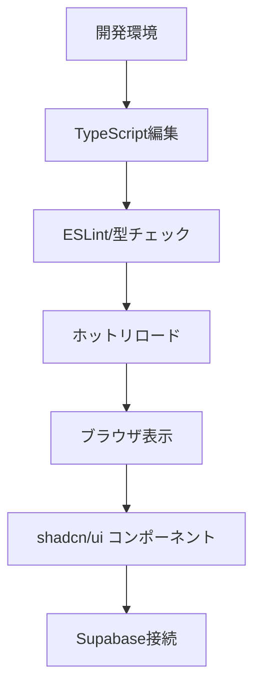

# プロジェクトセットアップ - 機能仕様書

## 📋 概要

**目的**: Driver Logbook v3 の開発基盤を構築し、効率的な開発環境を整備する
**価値**: 開発者が安心して機能実装に集中できる堅牢な基盤を提供
**優先度**: 高（他の全機能の前提条件）

## 🎯 要件

### 機能要件

- [x] Next.js 14 プロジェクトの初期化
- [x] TypeScript 設定と ESLint 設定
- [x] 必要な依存関係のインストール
- [ ] shadcn/ui コンポーネントライブラリのセットアップ
- [ ] Supabase クライアントの設定
- [ ] 環境変数の設定
- [ ] 基本的なプロジェクト構造の構築

### 非機能要件

- パフォーマンス: ビルド時間 5 分以内、起動時間 30 秒以内
- 開発体験: ホットリロード対応、型安全性の確保
- メンテナンス性: 一貫性のあるコード規約とディレクトリ構造

## 🔧 技術仕様

### 使用技術

- フロントエンド: Next.js 14 (App Router), TypeScript 5, Tailwind CSS
- UI ライブラリ: shadcn/ui (Radix UI + Tailwind CSS)
- バックエンド: Supabase (Database, Auth, Storage)
- フォーム: React Hook Form + Zod
- テスト: Vitest + Testing Library
- デプロイ: Vercel

### データフロー



## 💻 実装詳細

### ファイル構成

```
driver-logbook-v3/
├── src/
│   ├── app/
│   │   ├── globals.css           # グローバルスタイル
│   │   ├── layout.tsx           # ルートレイアウト
│   │   └── page.tsx             # ホームページ
│   ├── components/
│   │   └── ui/                  # shadcn/uiコンポーネント
│   ├── lib/
│   │   ├── utils.ts             # ユーティリティ関数
│   │   └── supabase/            # Supabase設定
│   └── types/                   # TypeScript型定義
├── docs/                        # プロジェクトドキュメント
├── package.json                 # 依存関係定義
├── tailwind.config.ts          # Tailwind設定
├── tsconfig.json               # TypeScript設定
└── components.json             # shadcn/ui設定
```

### 主要な設定ファイル

- **package.json**: 必要な依存関係が全て定義済み
- **tsconfig.json**: 厳密な TypeScript 設定
- **tailwind.config.ts**: カスタムカラーとアニメーション設定
- **components.json**: shadcn/ui 統合設定

## 🚀 セットアップ手順

### 1. 環境変数設定

```bash
# .env.localファイルを作成
NEXT_PUBLIC_SUPABASE_URL=your_supabase_project_url
NEXT_PUBLIC_SUPABASE_ANON_KEY=your_supabase_anon_key
```

### 2. shadcn/ui 初期化（次のステップ）

```bash
npx shadcn-ui@latest init
npx shadcn-ui@latest add button card input form select
npx shadcn-ui@latest add calendar date-picker toast navigation-menu
```

### 3. Supabase クライアント設定（次のステップ）

```typescript
// lib/supabase/client.ts
import { createClient } from '@supabase/ssr';

export const supabase = createClient(
  process.env.NEXT_PUBLIC_SUPABASE_URL!,
  process.env.NEXT_PUBLIC_SUPABASE_ANON_KEY!
);
```

## 🧪 テスト

### テストケース

- [x] プロジェクトが正常に起動する
- [x] TypeScript の型チェックが通る
- [x] ESLint エラーがない
- [ ] shadcn/ui コンポーネントが正常に動作する
- [ ] Supabase 接続が正常に確立される

### テスト実行方法

```bash
# 開発サーバー起動テスト
npm run dev

# ビルドテスト
npm run build

# 型チェック
npx tsc --noEmit

# ESLintチェック
npm run lint
```

## ⚠️ 注意事項

- Supabase の環境変数は必ずプロジェクト作成後に設定する
- shadcn/ui 初期化時はコンフリクトを避けるため段階的に実行
- TypeScript 設定は厳密モードを維持する

## 🔗 関連機能

- 次のフェーズ: 認証システム構築
- 依存関係: 全ての機能実装の基盤

## 📚 参考資料

- [Next.js 14 ドキュメント](https://nextjs.org/docs)
- [shadcn/ui セットアップガイド](https://ui.shadcn.com/docs/installation/next)
- [Supabase クライアントガイド](https://supabase.com/docs/reference/javascript/introduction)
- [実装計画書](./IMPLEMENTATION_PLAN.md)

## 📊 進捗状況

- ✅ **Phase 1-1**: プロジェクト初期化完了
- 🚧 **Phase 1-2**: shadcn/ui セットアップ（進行中）
- ⏳ **Phase 1-3**: Supabase 統合（予定）
- ⏳ **Phase 1-4**: 認証システム（予定）

---

**最終更新**: 2024 年 12 月
**責任者**: Driver Logbook 開発チーム
