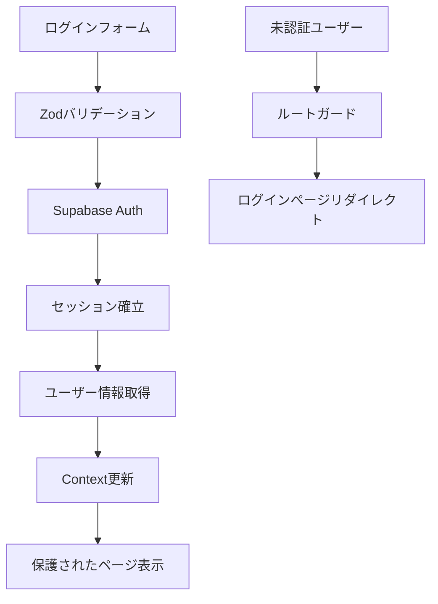

# 認証システム - 設計書

## 📋 概要

**目的**: 安全で使いやすい認証システムを構築し、ユーザーのプライバシーとデータを保護する
**価値**: 個人事業主ドライバーが安心して業務データを管理できる環境を提供
**優先度**: 高（全ての機能の前提条件）

## 🎯 要件

### 機能要件

- [ ] メール/パスワード認証
- [ ] ログイン・ログアウト機能
- [ ] パスワードリセット機能
- [ ] ユーザー登録機能
- [ ] 認証状態の永続化
- [ ] プロテクトルートの設定
- [ ] ユーザープロフィール表示
- [ ] 認証エラーハンドリング

### 非機能要件

- セキュリティ: パスワードハッシュ化、HTTPS 通信、セッション管理
- ユーザビリティ: 直感的なフォーム、分かりやすいエラーメッセージ
- パフォーマンス: 認証チェック 500ms 以内

## 🔧 技術仕様

### 使用技術

- 認証プロバイダ: Supabase Auth
- フロントエンド: Next.js 14 Server Components + Client Components
- フォーム: React Hook Form + Zod
- 状態管理: React Context + useReducer
- UI: shadcn/ui コンポーネント

### データフロー



### データベース設計

```sql
-- Supabase Authが自動生成するテーブル
-- auth.users (Supabase管理)

-- 追加のユーザー情報テーブル
create table users (
  id uuid primary key default auth.uid(),
  display_name text,
  role text default 'driver',
  unit_price integer,
  vehicle_info jsonb,
  created_at timestamp default now(),
  updated_at timestamp default now()
);

-- RLS (Row Level Security) 設定
alter table users enable row level security;

create policy "Users can view own data" on users
  for select using (auth.uid() = id);

create policy "Users can update own data" on users
  for update using (auth.uid() = id);
```

## 💻 実装計画

### ファイル構成

```
src/
├── app/
│   ├── (auth)/
│   │   ├── layout.tsx           # 認証レイアウト
│   │   ├── login/
│   │   │   └── page.tsx         # ログインページ
│   │   ├── signup/
│   │   │   └── page.tsx         # 登録ページ
│   │   └── reset-password/
│   │       └── page.tsx         # パスワードリセット
├── components/
│   ├── auth/
│   │   ├── login-form.tsx       # ログインフォーム
│   │   ├── signup-form.tsx      # 登録フォーム
│   │   ├── auth-provider.tsx    # 認証プロバイダ
│   │   └── logout-button.tsx    # ログアウトボタン
├── lib/
│   ├── auth/
│   │   ├── actions.ts           # 認証アクション
│   │   └── middleware.ts        # 認証ミドルウェア
│   ├── supabase/
│   │   ├── client.ts            # クライアントサイド
│   │   └── server.ts            # サーバーサイド
├── hooks/
│   └── use-auth.ts              # 認証カスタムフック
└── types/
    └── auth.ts                  # 認証関連型定義
```

### 主要コンポーネント設計

#### 1. AuthProvider

```typescript
// components/auth/auth-provider.tsx
interface AuthContextType {
  user: User | null;
  loading: boolean;
  signIn: (email: string, password: string) => Promise<void>;
  signUp: (email: string, password: string) => Promise<void>;
  signOut: () => Promise<void>;
  resetPassword: (email: string) => Promise<void>;
}
```

#### 2. LoginForm

```typescript
// components/auth/login-form.tsx
const loginSchema = z.object({
  email: z.string().email('有効なメールアドレスを入力してください'),
  password: z.string().min(6, 'パスワードは6文字以上である必要があります'),
});
```

#### 3. ProtectedRoute

```typescript
// コンポーネントラッパー
const ProtectedRoute = ({ children }: { children: React.ReactNode }) => {
  const { user, loading } = useAuth();

  if (loading) return <LoadingSpinner />;
  if (!user) redirect('/login');

  return <>{children}</>;
};
```

## 🚀 実装手順

### Phase 1: 基本認証機能

1. Supabase 認証設定
2. AuthProvider コンテキスト作成
3. ログイン・登録フォーム実装
4. 基本的なルートガード実装

### Phase 2: 高度な機能

1. パスワードリセット機能
2. ユーザープロフィール管理
3. エラーハンドリング強化
4. 認証状態の永続化

### Phase 3: UX 改善

1. ローディング状態の改善
2. エラーメッセージの日本語化
3. フォームバリデーションの強化
4. リダイレクト処理の最適化

## 🧪 テスト計画

### テストケース

- [ ] **正常系**
  - 有効な認証情報でログイン成功
  - 新規ユーザー登録成功
  - ログアウト機能動作
- [ ] **異常系**
  - 無効なメールアドレス
  - 短すぎるパスワード
  - 存在しないユーザー
  - ネットワークエラー
- [ ] **境界値**
  - パスワード最小長
  - メールアドレス形式
  - 連続ログイン試行

### テスト実装例

```typescript
// __tests__/auth/login-form.test.tsx
describe('LoginForm', () => {
  it('有効な認証情報でログインできる', async () => {
    render(<LoginForm />);

    await userEvent.type(
      screen.getByLabelText('メールアドレス'),
      'test@example.com'
    );
    await userEvent.type(screen.getByLabelText('パスワード'), 'password123');
    await userEvent.click(screen.getByRole('button', { name: 'ログイン' }));

    expect(mockSignIn).toHaveBeenCalledWith('test@example.com', 'password123');
  });
});
```

## ⚠️ セキュリティ考慮事項

### 必須対策

1. **パスワード要件**: 最小 6 文字、複雑性要求
2. **CSRF 保護**: Supabase が自動対応
3. **XSS 対策**: React 本来の対策 + バリデーション
4. **セッション管理**: Supabase が自動管理
5. **HTTPS 強制**: 本番環境では必須

### 追加セキュリティ

1. **レート制限**: ログイン試行回数制限
2. **2FA**: 将来的な拡張機能
3. **監査ログ**: 認証イベントの記録

## 🔗 関連機能

- **前提条件**: プロジェクトセットアップ完了
- **次のフェーズ**: 日報機能（認証済みユーザーのみ）
- **連携機能**: 全ての業務機能がこの認証システムに依存

## 📚 参考資料

- [Supabase Auth ドキュメント](https://supabase.com/docs/guides/auth)
- [Next.js 14 認証パターン](https://nextjs.org/docs/app/building-your-application/authentication)
- [React Hook Form ガイド](https://react-hook-form.com/get-started)
- [Zod バリデーション](https://zod.dev/)

## 📊 想定工数

- **設計・準備**: 0.5 日
- **基本実装**: 2 日
- **テスト作成**: 1 日
- **統合・調整**: 0.5 日
- **合計**: 4 日

## 🎯 成功基準

- [ ] ユーザーが迷わずログインできる
- [ ] 認証エラーが分かりやすく表示される
- [ ] 認証状態が適切に管理される
- [ ] セキュリティベストプラクティスが適用される
- [ ] レスポンシブデザインで快適に操作できる

---

**最終更新**: 2024 年 12 月
**責任者**: Driver Logbook 開発チーム
