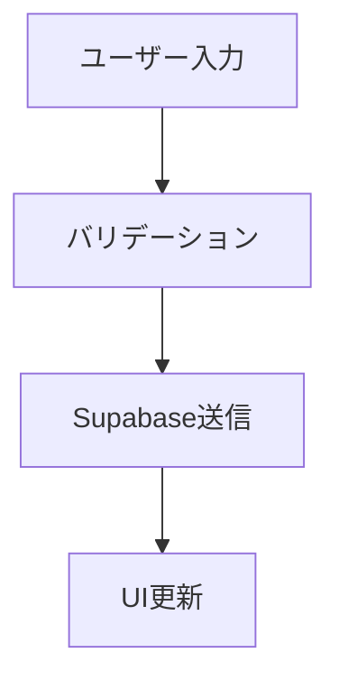

# Cursor 開発におけるドキュメント生成プロンプト集

## 🎯 概要

Driver Log Book v3 の開発において、機能実装と並行してドキュメント生成を自動化するためのプロンプト集です。Cursor のエージェント機能と Ask モードを活用し、開発効率を維持しながら質の高いドキュメントを継続的に生成します。

## 📋 機能完成時の自動ドキュメント生成プロンプト

### 🤖 エージェント機能用：メインプロンプト

````prompt
## ドキュメント生成指示

以下の機能実装が完了しました。開発ドキュメントを自動生成してください：

### 実装状況の確認
- 実装したフェーズ・タスク番号：{Phase X-Y: タスク名}
- 関連ファイル：{実装したファイルパスを列挙}
- 機能概要：{実装した機能の1行説明}

### 生成するドキュメント種類
1. **機能仕様書** - 実装した機能の詳細仕様
2. **使用方法ガイド** - 開発者向けの使い方説明
3. **APIドキュメント** - エンドポイントや関数の仕様
4. **コード例集** - 実用的なサンプルコード

### ドキュメント生成ルール
- Markdown形式で出力
- Driver Log Book要件定義書の構造に準拠
- 日本語で記述（コメントも日本語）
- 初学者でも理解できる説明レベル
- コード例は実際に動作するもの
- 依存関係や前提条件を明記

### 出力構造
```markdown
# 機能名 - {実装した機能名}

## 概要
{機能の目的と価値}

## 実装詳細
{技術的な実装内容}

## 使用方法
{開発者向けの使い方}

## API仕様
{関数・エンドポイントの詳細}

## コード例
{実際に動作するサンプル}

## 注意事項・制限
{既知の制限や注意点}

## 関連機能
{他の機能との連携}
````

### 品質チェック項目

- [ ] 要件定義書との整合性
- [ ] TypeScript 型定義の正確性
- [ ] Supabase スキーマとの一致
- [ ] shadcn/ui コンポーネントの適切な使用
- [ ] エラーハンドリングの説明
- [ ] テストケースの例示

現在のコードベースを分析し、上記の形式でドキュメントを生成してください。

````

### 💡 Askモード用：段階的質問テンプレート

#### Step 1: 実装確認
```prompt
現在実装中の機能について教えてください：
1. 完了したタスクID（例：Task 3-1）
2. 実装したファイル一覧
3. 新しく追加した機能やコンポーネント
4. 変更した既存機能

このファイルを見て実装状況を確認してください。
````

#### Step 2: ドキュメント範囲確定

```prompt
以下の観点で生成するドキュメントの範囲を決めましょう：

【対象機能】
- メイン機能：
- 補助機能：
- 共通コンポーネント：

【ドキュメント種類】
以下から必要なものを選択：
- [ ] 機能仕様書（詳細な動作説明）
- [ ] 使用方法ガイド（開発者向け）
- [ ] APIリファレンス（関数・型定義）
- [ ] UI/UXガイド（コンポーネント使用法）
- [ ] データベース設計書（Supabaseスキーマ）
- [ ] テスト仕様書（テストケース例）

【想定読者】
- [ ] 開発チームメンバー
- [ ] 新規参加者
- [ ] 利用者（エンドユーザー）
```

#### Step 3: ドキュメント生成

```prompt
確定した範囲で以下の形式でドキュメントを生成してください：

【必須項目】
- 機能概要（目的・価値・ユースケース）
- 技術仕様（使用技術・依存関係）
- 実装詳細（主要なロジック・アルゴリズム）
- 使用方法（コード例付き）
- API仕様（関数シグネチャ・型定義）
- エラーハンドリング（想定される例外）
- テスト方法（テストケースの例）

【コード例の要件】
- TypeScript + Next.js 14
- shadcn/ui コンポーネント使用
- Supabase クライアント操作
- react-hook-form + zod バリデーション
- 実際に動作するコード
- 日本語コメント付き

【品質基準】
- Driver Log Book要件定義書との整合性
- 初学者でも理解できる説明
- 実用的で再利用可能な例
```

## ⏰ ドキュメント生成タイミング

### 📊 タイミング判定基準

| タイミング         | 条件                        | 生成対象                    |
| ------------------ | --------------------------- | --------------------------- |
| **機能完成時**     | 1 つのフェーズ（Phase）完了 | 機能仕様書 + 使用方法ガイド |
| **API 実装時**     | CRUD 操作・API 関数追加     | API リファレンス            |
| **UI 完成時**      | ページ・コンポーネント完成  | UI/UX ガイド                |
| **スキーマ変更時** | Supabase テーブル変更       | データベース設計書          |
| **テスト追加時**   | テストケース実装            | テスト仕様書                |
| **マイルストーン** | 週次・月次の区切り          | 統合ドキュメント            |

### 🎯 「キリのいいところ」の具体的定義

#### Phase 別完了基準

```prompt
以下の基準に達したらドキュメント生成を実行：

【Phase 1: プロジェクト基盤構築】
✅ Supabaseスキーマ作成完了
✅ 認証システム動作確認完了
✅ 基本レイアウト表示完了

【Phase 2: 認証システム】
✅ ログイン・ログアウト機能動作
✅ プロテクトルート設定完了
✅ ユーザープロフィール表示完了

【Phase 3: 日報機能】
✅ 日報CRUD操作完了
✅ バリデーション動作確認
✅ 一覧表示・フィルター機能完了

【Phase 4: ダッシュボード】
✅ KPIカード表示完了
✅ グラフ表示機能完了
✅ 期間フィルター動作完了

【Phase 5-6: 車両・経費管理】
✅ 各種CRUD操作完了
✅ リマインダー機能動作
✅ エクスポート機能完了

現在どのPhaseのどの項目まで完了していますか？
完了状況に応じて適切なドキュメントを生成します。
```

## 📝 ドキュメント形式テンプレート

### 🏗️ 機能仕様書テンプレート

````markdown
# {機能名} - 機能仕様書

## 📋 概要

**目的**: {この機能が解決する課題}
**価値**: {ユーザーにとってのメリット}
**優先度**: {高/中/低}

## 🎯 要件

### 機能要件

- [ ] {具体的な機能要件 1}
- [ ] {具体的な機能要件 2}

### 非機能要件

- パフォーマンス: {レスポンス時間など}
- ユーザビリティ: {操作性の要件}
- セキュリティ: {セキュリティ要件}

## 🔧 技術仕様

### 使用技術

- フロントエンド: {Next.js, TypeScript, shadcn/ui}
- バックエンド: {Supabase 機能}
- 状態管理: {useContext, useReducer}

### データフロー


````

### データベース設計

```sql
-- 関連テーブル構造
{実際のSQLスキーマ}
```

## 💻 実装詳細

### ファイル構成

```
src/
├── components/
│   └── {関連コンポーネント}
├── lib/
│   └── {ユーティリティ関数}
└── app/
    └── {ページファイル}
```

### 主要なロジック

{重要なアルゴリズムや処理フローの説明}

## 🚀 使用方法

### 基本的な使い方

```typescript
// 使用例
{
  実際に動作するコード例;
}
```

### 高度な使用例

```typescript
// カスタマイズ例
{
  応用的な使用方法;
}
```

## 🧪 テスト

### テストケース

- [ ] {正常系テスト}
- [ ] {異常系テスト}
- [ ] {境界値テスト}

### テスト実行方法

```bash
npm run test {テストファイル名}
```

## ⚠️ 注意事項

- {既知の制限事項}
- {パフォーマンス上の注意点}
- {セキュリティ上の注意点}

## 🔗 関連機能

- {関連する機能への参照}
- {依存関係の説明}

## 📚 参考資料

- [要件定義書](../README.md)
- [実装計画書](./IMPLEMENTATION_PLAN.md)

````

### 🛠️ APIリファレンステンプレート

```markdown
# {機能名} - API仕様書

## 🔍 関数一覧

### {関数名}
**目的**: {関数の目的と役割}

```typescript
// 型定義
type {InputType} = {
  // プロパティ定義
}

type {OutputType} = {
  // 戻り値の型定義
}

// 関数シグネチャ
function {関数名}(params: {InputType}): Promise<{OutputType}>
````

**パラメータ**
| 名前 | 型 | 必須 | 説明 |
|------|----|----|------|
| {param1} | {型} | ✅/❌ | {説明} |

**戻り値**
| プロパティ | 型 | 説明 |
|------------|----|----|
| {property1} | {型} | {説明} |

**使用例**

```typescript
// 基本的な使用方法
const result = await {関数名}({
  // パラメータ例
});

// エラーハンドリング込み
try {
  const result = await {関数名}(params);
  // 成功時の処理
} catch (error) {
  // エラーハンドリング
}
```

**エラー一覧**
| エラーコード | 説明 | 対処法 |
|--------------|------|--------|
| {ERROR_CODE} | {説明} | {対処法} |

````

## 🔄 継続的ドキュメント更新プロンプト

### 📊 定期チェック用プロンプト

```prompt
## 週次ドキュメント更新チェック

以下の観点でドキュメントの更新が必要か確認してください：

### コード変更チェック
1. 新しく追加された機能はありますか？
2. 既存機能に変更はありましたか？
3. APIの仕様変更はありましたか？
4. データベーススキーマの変更はありましたか？

### ドキュメント品質チェック
1. 古くなった情報はありませんか？
2. 不足している説明はありませんか？
3. コード例は動作しますか？
4. リンクは正しく機能していますか？

### 更新対象の特定
変更があった場合、以下のドキュメントの更新を検討：
- [ ] 機能仕様書
- [ ] APIリファレンス
- [ ] 使用方法ガイド
- [ ] データベース設計書
- [ ] テスト仕様書

更新が必要な項目について、差分を明確にして更新版を生成してください。
````

### 🎯 品質保証プロンプト

```prompt
## ドキュメント品質チェック

生成したドキュメントを以下の基準で評価してください：

### 内容の正確性
- [ ] コード例は実際に動作する
- [ ] 型定義は最新のコードと一致
- [ ] APIエンドポイントは正確
- [ ] 依存関係は最新

### 理解しやすさ
- [ ] 初学者でも理解できる説明
- [ ] 段階的な説明構成
- [ ] 具体例が豊富
- [ ] 図表を適切に使用

### 実用性
- [ ] 実際の開発で使える内容
- [ ] トラブルシューティング情報
- [ ] ベストプラクティスの紹介
- [ ] よくある質問への回答

### メンテナンス性
- [ ] 更新しやすい構造
- [ ] バージョン管理情報
- [ ] 変更履歴の記録
- [ ] 責任者の明記

改善点があれば具体的に指摘し、修正版を提案してください。
```

## 🎨 Cursor 特有の活用方法

### 🤖 エージェント機能での自動化

```prompt
## Cursorエージェント設定

以下のタスクを自動実行するようにエージェントを設定：

### 自動ドキュメント生成トリガー
1. **ファイル変更検知**: 特定のファイルが更新されたらドキュメント生成
2. **コミットフック**: git commitと同時にドキュメント更新
3. **定期実行**: 週次でドキュメント品質チェック

### 生成ルール
- 新機能追加時: 機能仕様書 + 使用方法ガイド
- API変更時: APIリファレンス更新
- UI変更時: UI/UXガイド更新
- スキーマ変更時: データベース設計書更新

### 品質チェック
各ドキュメント生成後に以下をチェック：
- 要件定義書との整合性
- 既存ドキュメントとの矛盾
- リンクの有効性
- コード例の動作確認

エラーがあった場合は修正提案を自動生成してください。
```

### 💬 Ask モードでの効率的な質問

```prompt
## 段階的ドキュメント生成

以下の順序で質問し、効率的にドキュメントを生成します：

### Phase 1: 現状把握
「現在の実装状況を教えてください」
- 完了した機能
- 作業中の機能
- 次に予定している機能

### Phase 2: 範囲確定
「どの部分のドキュメントが必要ですか？」
- 機能別の優先順位
- 読者の想定
- 詳細レベルの要求

### Phase 3: 生成・調整
「生成したドキュメントに修正点はありますか？」
- 内容の過不足
- 説明のレベル調整
- 追加したい項目

この流れで段階的にドキュメントを完成させましょう。
```

## 📋 実用例：Daily Report 機能のドキュメント生成

### 🎯 完成時のプロンプト実行例

```prompt
Phase 3（日報機能）が完了しました。以下の実装についてドキュメントを生成してください：

【完了タスク】
- Task 3-1: Zodスキーマ定義（lib/validations/daily-report.ts）
- Task 3-2: 日報作成フォーム（components/reports/DailyReportForm.tsx）
- Task 3-3: 日報一覧表示（app/reports/page.tsx, components/reports/DailyReportList.tsx）
- Task 3-4: 日報編集・削除機能（app/reports/[id]/edit/page.tsx）
- Task 3-5: Supabaseクライアント関数（lib/supabase/queries/daily-reports.ts）

【実装した機能】
1. 日報の作成・読取・更新・削除（CRUD）
2. react-hook-form + zodによるバリデーション
3. shadcn/uiコンポーネントを使用したUI
4. Supabaseでのデータ永続化
5. エラーハンドリングとローディング状態

【生成希望ドキュメント】
- 機能仕様書
- APIリファレンス
- 使用方法ガイド（開発者向け）

要件定義書の内容と整合性を取りながら、実用的なドキュメントを生成してください。
```

## 🆕 プロジェクト特化型改善案

### 🔧 Driver Logbook 特化プロンプト

```prompt
## Driver Logbook特化ドキュメント生成

### プロジェクト固有の要素を含めて生成：

【業務コンテキスト】
- 委託ドライバーの業務フロー
- 軽貨物配送業界の用語
- 法的要件（労働時間記録等）

【技術スタック特化】
- Next.js 14 App Router パターン
- Supabase RLS設定例
- shadcn/ui コンポーネント一覧
- react-hook-form + zod パターン集

【ユーザー視点】
- ドライバー（主要ユーザー）
- 事務担当（副次ユーザー）
- 初心者開発者（保守担当）

【実装パターン】
- CRUD操作の標準形
- エラーハンドリングパターン
- 状態管理パターン
- テストパターン

この観点を含めてドキュメントを生成してください。
```

### 📊 自動進捗追跡プロンプト

```prompt
## 実装進捗に基づく自動ドキュメント提案

現在の実装状況を分析し、以下を自動判定：

1. **完了した機能**: チェックボックスが✅のタスク
2. **実装中の機能**: ファイルが存在するが未完了のタスク
3. **未着手の機能**: ファイルが存在しないタスク

### 提案内容
- 完了機能: 「ドキュメント生成可能」
- 実装中機能: 「一部ドキュメント生成可能」
- 未着手機能: 「設計書生成可能」

### 自動生成ドキュメント
- 📋 完了機能 → 機能仕様書
- 🚧 実装中機能 → 開発メモ
- 📝 未着手機能 → 設計書

実装状況を確認して、最適なドキュメント生成を提案してください。
```

この形式でプロンプトを使用することで、開発と並行して質の高いドキュメントを効率的に生成できます。
