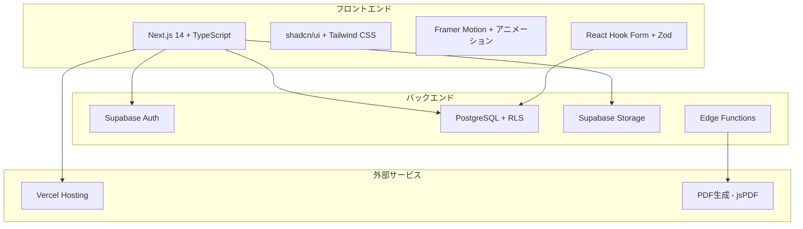
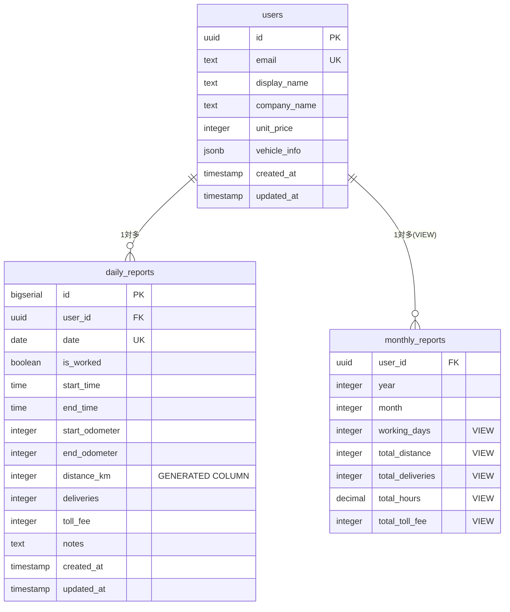
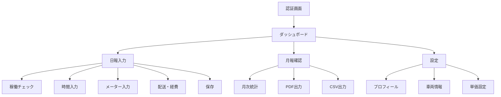
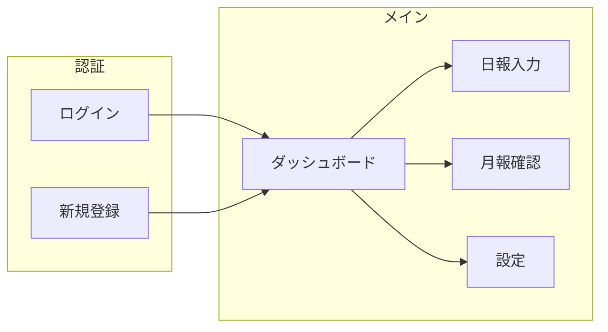
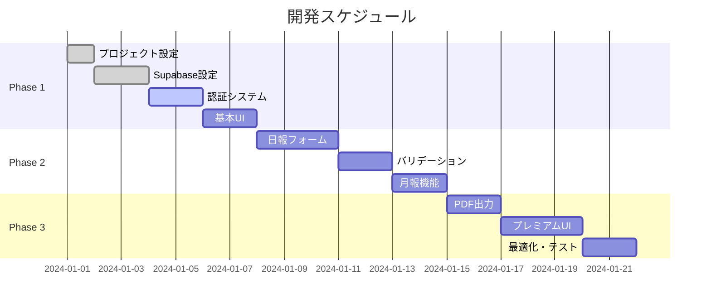

#driver-logbook-v4

**委託ドライバー業務効率化プレミアムアプリ**

## 📋 プロジェクト概要

### ミッション

**「ただの管理ツールを超えた、プロフェッショナルドライバーのためのプレミアム体験」**

委託ドライバーの日報・月報作業をデジタル化し、毎日使うことが楽しくなる高級感あふれるアプリケーションを提供。

### 🎯 成功指標

- **入力時間短縮**: 10 分 → 2 分以下
- **月報作成**: 1 時間 → 5 分以下
- **継続利用率**: 30 日後 70%以上
- **ユーザー満足度**: 「毎日使いたい」95%以上

---

## 🏗️ システムアーキテクチャ



---

## 📊 データベース設計



### データベーススキーマ

```sql
-- ユーザーテーブル
CREATE TABLE users (
  id UUID PRIMARY KEY DEFAULT auth.uid(),
  email TEXT UNIQUE NOT NULL,
  display_name TEXT,
  company_name TEXT,
  unit_price INTEGER DEFAULT 0,
  vehicle_info JSONB,
  created_at TIMESTAMP DEFAULT NOW(),
  updated_at TIMESTAMP DEFAULT NOW()
);

-- 日報テーブル
CREATE TABLE daily_reports (
  id BIGSERIAL PRIMARY KEY,
  user_id UUID REFERENCES users(id) ON DELETE CASCADE,
  date DATE NOT NULL,
  is_worked BOOLEAN DEFAULT FALSE,
  start_time TIME,
  end_time TIME,
  start_odometer INTEGER,
  end_odometer INTEGER,
  distance_km INTEGER GENERATED ALWAYS AS (
    CASE
      WHEN end_odometer >= start_odometer THEN end_odometer - start_odometer
      WHEN end_odometer < start_odometer THEN (999999 - start_odometer) + end_odometer + 1
      ELSE 0
    END
  ) STORED,
  deliveries INTEGER DEFAULT 0,
  toll_fee INTEGER DEFAULT 0,
  notes TEXT,
  created_at TIMESTAMP DEFAULT NOW(),
  updated_at TIMESTAMP DEFAULT NOW(),

  UNIQUE(user_id, date),
  CONSTRAINT check_working_time CHECK (
    (is_worked = FALSE) OR
    (is_worked = TRUE AND start_time IS NOT NULL AND end_time IS NOT NULL)
  )
);

-- RLS設定
ALTER TABLE daily_reports ENABLE ROW LEVEL SECURITY;
CREATE POLICY "Users can only access own reports"
  ON daily_reports FOR ALL
  USING (auth.uid() = user_id);

-- 月報ビュー
CREATE VIEW monthly_reports AS
SELECT
  user_id,
  EXTRACT(YEAR FROM date) as year,
  EXTRACT(MONTH FROM date) as month,
  COUNT(*) FILTER (WHERE is_worked = TRUE) as working_days,
  COALESCE(SUM(distance_km), 0) as total_distance,
  COALESCE(SUM(deliveries), 0) as total_deliveries,
  COALESCE(SUM(toll_fee), 0) as total_toll_fee,
  COALESCE(SUM(
    EXTRACT(EPOCH FROM (end_time - start_time)) / 3600
  ) FILTER (WHERE is_worked = TRUE), 0) as total_hours
FROM daily_reports
GROUP BY user_id, EXTRACT(YEAR FROM date), EXTRACT(MONTH FROM date);
```

---

## 🎨 プレミアムデザインシステム

### カラーパレット

```css
:root {
  /* プレミアムダーク */
  --background: 222 25% 4%; /* リッチブラック */
  --foreground: 220 5% 95%;

  /* メインカラー */
  --primary: 240 100% 8%; /* ミッドナイトブルー */
  --primary-foreground: 240 10% 95%;

  /* アクセント - エレガントゴールド */
  --accent: 45 100% 70%;
  --accent-foreground: 45 10% 10%;

  /* カード・サーフェス */
  --card: 220 20% 8%;
  --card-foreground: 220 5% 95%;

  /* グラデーション */
  --gradient-primary: linear-gradient(
    135deg,
    #1e293b 0%,
    #334155 50%,
    #475569 100%
  );
  --gradient-accent: linear-gradient(
    135deg,
    #f59e0b 0%,
    #f97316 50%,
    #ef4444 100%
  );
}
```

### タイポグラフィ

```css
@import url('https://fonts.googleapis.com/css2?family=Inter:wght@300;400;500;600;700&family=JetBrains+Mono:wght@400;500;600&display=swap');

.font-display {
  font-family: 'Inter', 'Noto Sans JP', sans-serif;
  font-weight: 600;
  letter-spacing: -0.025em;
}

.number-display {
  font-family: 'JetBrains Mono', monospace;
  font-weight: 600;
  background: var(--gradient-accent);
  -webkit-background-clip: text;
  -webkit-text-fill-color: transparent;
}
```

---

## 📱 UI/UX 設計

### アプリケーション構造



### ページ構成



---

## 🔧 技術仕様

### フロントエンド技術スタック

```typescript
// package.json 依存関係
{
  "dependencies": {
    "next": "^14.0.0",
    "react": "^18.0.0",
    "typescript": "^5.0.0",
    "@supabase/supabase-js": "^2.38.0",
    "@supabase/ssr": "^0.0.10",
    "react-hook-form": "^7.47.0",
    "@hookform/resolvers": "^3.3.0",
    "zod": "^3.22.0",
    "date-fns": "^2.30.0",
    "@radix-ui/react-*": "^1.0.0",
    "lucide-react": "^0.294.0",
    "framer-motion": "^10.16.0",
    "jspdf": "^2.5.1",
    "tailwindcss": "^3.3.0",
    "class-variance-authority": "^0.7.0",
    "clsx": "^2.0.0",
    "tailwind-merge": "^2.0.0"
  }
}
```

### API 設計

```typescript
// Supabaseクライアント関数
export class DailyReportsService {
  // 日報作成
  static async create(data: CreateDailyReportInput): Promise<DailyReport>;

  // 日報取得（日付指定）
  static async getByDate(
    userId: string,
    date: string
  ): Promise<DailyReport | null>;

  // 月報取得
  static async getMonthlyReport(
    userId: string,
    year: number,
    month: number
  ): Promise<MonthlyReport>;

  // 最新メーター値取得
  static async getLastOdometerReading(userId: string): Promise<number | null>;

  // 日報一覧取得
  static async getReports(
    userId: string,
    filters: ReportFilters
  ): Promise<DailyReport[]>;
}
```

### データモデル

```typescript
// 型定義
interface DailyReport {
  id: string;
  userId: string;
  date: Date;
  isWorked: boolean;
  startTime: string; // "09:00"
  endTime: string; // "18:30"
  startOdometer: number; // 開始メーター
  endOdometer: number; // 終了メーター
  distance: number; // 自動計算距離
  deliveries: number; // 配送件数
  tollFee?: number; // 高速料金
  notes?: string; // 備考
  createdAt: Date;
  updatedAt: Date;
}

interface MonthlyReport {
  userId: string;
  year: number;
  month: number;
  workingDays: number;
  totalDistance: number;
  totalDeliveries: number;
  totalHours: number;
  totalTollFee: number;
  averageDeliveries: number;
  averageDistance: number;
}
```

---

## 🎮 主要コンポーネント設計

### ファイル構成

```
src/
├── app/                     # Next.js 14 App Router
│   ├── (auth)/
│   │   ├── login/
│   │   └── register/
│   ├── (dashboard)/
│   │   ├── page.tsx         # ダッシュボード
│   │   ├── reports/         # 日報管理
│   │   ├── monthly/         # 月報確認
│   │   └── settings/        # 設定
│   ├── layout.tsx
│   └── globals.css
├── components/              # 再利用可能コンポーネント
│   ├── ui/                  # shadcn/ui components
│   ├── forms/               # フォーム関連
│   │   ├── DailyReportForm.tsx
│   │   ├── TimeInput.tsx
│   │   └── OdometerInput.tsx
│   ├── dashboard/           # ダッシュボード
│   │   ├── StatsCard.tsx
│   │   ├── StreakCounter.tsx
│   │   └── AchievementBadge.tsx
│   └── layout/              # レイアウト
│       ├── Header.tsx
│       ├── Sidebar.tsx
│       └── BottomNav.tsx
├── lib/                     # ユーティリティ
│   ├── supabase/
│   │   ├── client.ts
│   │   ├── server.ts
│   │   └── queries/
│   ├── validations/         # Zodスキーマ
│   ├── utils.ts
│   └── constants.ts
├── contexts/                # React Context
│   ├── AuthContext.tsx
│   └── ThemeContext.tsx
└── types/                   # TypeScript型定義
    ├── database.ts
    └── app.ts
```

### 重要コンポーネント

#### 1. 日報入力フォーム

```typescript
// components/forms/DailyReportForm.tsx
const DailyReportForm = () => {
  const { register, handleSubmit, watch, setValue } = useForm<DailyReportForm>({
    resolver: zodResolver(dailyReportSchema),
  });

  const isWorked = watch('isWorked');
  const startOdometer = watch('startOdometer');
  const endOdometer = watch('endOdometer');

  // 距離自動計算
  const calculatedDistance = useMemo(
    () => calculateDistance(startOdometer, endOdometer),
    [startOdometer, endOdometer]
  );

  return (
    <Card className="premium-card">
      <CardHeader>
        <CardTitle className="premium-title">今日の稼働記録</CardTitle>
      </CardHeader>

      <CardContent>
        {/* 稼働チェック */}
        <PremiumSwitch
          label="今日は稼働日ですか？"
          checked={isWorked}
          onChange={(checked) => setValue('isWorked', checked)}
        />

        {isWorked && (
          <motion.div
            initial={{ opacity: 0, y: 20 }}
            animate={{ opacity: 1, y: 0 }}
            className="space-y-6"
          >
            {/* 時間入力 */}
            <div className="grid grid-cols-2 gap-6">
              <PremiumTimeInput label="開始時間" {...register('startTime')} />
              <PremiumTimeInput label="終了時間" {...register('endTime')} />
            </div>

            {/* メーター入力 */}
            <PremiumOdometerSection
              startValue={startOdometer}
              endValue={endOdometer}
              calculatedDistance={calculatedDistance}
              onStartChange={(value) => setValue('startOdometer', value)}
              onEndChange={(value) => setValue('endOdometer', value)}
            />

            {/* 配送・経費 */}
            <div className="grid grid-cols-2 gap-6">
              <PremiumNumberInput
                label="配送件数"
                icon={<Package />}
                {...register('deliveries')}
              />
              <PremiumNumberInput
                label="高速料金"
                icon={<Highway />}
                {...register('tollFee')}
              />
            </div>
          </motion.div>
        )}

        <PremiumSubmitButton
          onSubmit={handleSubmit(onSubmit)}
          isLoading={isSubmitting}
        />
      </CardContent>
    </Card>
  );
};
```

#### 2. プレミアム時間入力

```typescript
// components/forms/TimeInput.tsx
const PremiumTimeInput = ({ label, value, onChange, ...props }) => {
  const setCurrentTime = () => {
    const now = format(new Date(), 'HH:mm');
    onChange(now);
  };

  return (
    <div className="space-y-3">
      <Label className="premium-label">
        <Clock className="h-4 w-4" />
        {label}
      </Label>
      <div className="relative">
        <Input
          type="time"
          value={value}
          onChange={(e) => onChange(e.target.value)}
          className="premium-time-input"
          {...props}
        />
        <Button
          type="button"
          variant="ghost"
          size="sm"
          onClick={setCurrentTime}
          className="absolute right-2 top-1/2 -translate-y-1/2 premium-now-button"
        >
          現在
        </Button>
      </div>
    </div>
  );
};
```

---

## 🧪 バリデーション

### Zod スキーマ

```typescript
// lib/validations/daily-report.ts
export const dailyReportSchema = z
  .object({
    date: z.date(),
    isWorked: z.boolean(),
    startTime: z
      .string()
      .regex(/^([0-1]?[0-9]|2[0-3]):[0-5][0-9]$/)
      .optional(),
    endTime: z
      .string()
      .regex(/^([0-1]?[0-9]|2[0-3]):[0-5][0-9]$/)
      .optional(),
    startOdometer: z.number().min(0).max(999999).optional(),
    endOdometer: z.number().min(0).max(999999).optional(),
    deliveries: z.number().min(0).max(999).optional(),
    tollFee: z.number().min(0).optional(),
    notes: z.string().max(500).optional(),
  })
  .refine(
    (data) => {
      if (data.isWorked) {
        return (
          data.startTime &&
          data.endTime &&
          data.startOdometer !== undefined &&
          data.endOdometer !== undefined
        );
      }
      return true;
    },
    {
      message: '稼働日は時間とメーター値の入力が必要です',
    }
  )
  .refine(
    (data) => {
      if (data.startTime && data.endTime) {
        return data.endTime > data.startTime;
      }
      return true;
    },
    {
      message: '終了時間は開始時間より後である必要があります',
    }
  );
```

---

## 🚀 開発ロードマップ

### Phase 1: 基盤構築（Week 1）



#### Week 1: プロジェクト基盤

- [ ] Next.js 14 + TypeScript プロジェクト作成
- [ ] Supabase プロジェクト設定・データベース構築
- [ ] 認証システム実装（メール/パスワード）
- [ ] shadcn/ui セットアップ・基本レイアウト

#### Week 2: コア機能実装

- [ ] 日報入力フォーム（時間・メーター・配送件数）
- [ ] 距離自動計算ロジック
- [ ] バリデーション・エラーハンドリング
- [ ] 月報自動集計機能

#### Week 3: 高度な機能

- [ ] PDF 出力（既存フォーマット準拠）
- [ ] プレミアムデザイン適用
- [ ] アニメーション・マイクロインタラクション
- [ ] モバイル最適化

#### Week 4: 仕上げ・テスト

- [ ] パフォーマンス最適化
- [ ] エラー処理・ローディング状態
- [ ] E2E テスト実装
- [ ] デプロイ・本番確認

---

## 🧪 テスト戦略

### テスト構成

```typescript
// テスト設定
// vitest.config.ts
export default defineConfig({
  plugins: [react()],
  test: {
    environment: 'jsdom',
    setupFiles: ['./test/setup.ts'],
  },
});

// test/setup.ts
import '@testing-library/jest-dom';
import { beforeAll, afterEach, afterAll } from 'vitest';
import { server } from './mocks/server';

beforeAll(() => server.listen());
afterEach(() => server.resetHandlers());
afterAll(() => server.close());
```

### 単体テスト例

```typescript
// __tests__/DailyReportForm.test.tsx
import { render, screen, userEvent } from '@testing-library/react';
import { DailyReportForm } from '@/components/forms/DailyReportForm';

describe('DailyReportForm', () => {
  test('現在時刻ボタンで時間が入力される', async () => {
    const user = userEvent.setup();
    render(<DailyReportForm />);

    await user.click(screen.getByRole('checkbox', { name: /稼働日/ }));
    await user.click(screen.getByText('現在'));

    const timeInput = screen.getByLabelText('開始時間');
    expect(timeInput).toHaveValue(expect.stringMatching(/^\d{2}:\d{2}$/));
  });

  test('距離が自動計算される', async () => {
    const user = userEvent.setup();
    render(<DailyReportForm />);

    await user.click(screen.getByRole('checkbox', { name: /稼働日/ }));
    await user.type(screen.getByLabelText('開始メーター'), '100000');
    await user.type(screen.getByLabelText('終了メーター'), '100150');

    expect(screen.getByText('150 km')).toBeInTheDocument();
  });
});
```

---

## 🔐 セキュリティ・パフォーマンス

### セキュリティ対策

- **Row Level Security (RLS)**: 個人データ完全分離
- **型安全性**: TypeScript + Zod による入力値検証
- **XSS 対策**: React 標準エスケープ + CSP 設定
- **認証**: Supabase Auth + JWT 自動管理

### パフォーマンス最適化

- **Code Splitting**: Next.js 14 App Router 自動分割
- **画像最適化**: Next.js Image コンポーネント
- **キャッシュ戦略**: Supabase Realtime + SWR
- **Bundle 最適化**: Tree Shaking + 動的インポート

---

## 🎯 実装時のチェックリスト

### 🏗️ セットアップ

- [ ] Next.js 14 + TypeScript プロジェクト作成
- [ ] Supabase プロジェクト作成・環境変数設定
- [ ] shadcn/ui 初期化・必要コンポーネント追加
- [ ] Tailwind CSS + カスタムカラー設定

### 🗄️ データベース

- [ ] ユーザーテーブル作成
- [ ] 日報テーブル作成（距離自動計算カラム含む）
- [ ] 月報ビュー作成
- [ ] RLS ポリシー設定
- [ ] インデックス作成

### 🎨 UI 実装

- [ ] プレミアムデザインシステム適用
- [ ] レスポンシブレイアウト
- [ ] ダークモード対応
- [ ] アニメーション・マイクロインタラクション

### 🔧 機能実装

- [ ] 認証フロー（ログイン・新規登録）
- [ ] 日報 CRUD 機能
- [ ] 月報自動集計
- [ ] PDF 出力機能
- [ ] バリデーション・エラーハンドリング

### 🧪 テスト・最適化

- [ ] 単体テスト（主要コンポーネント）
- [ ] E2E テスト（主要フロー）
- [ ] パフォーマンステスト
- [ ] モバイル実機確認

---

## 📝 Cursor 実装指示例

開発時は以下のような指示で Cursor に実装を依頼してください：

### 例 1: プロジェクト初期設定

```
この設計書に基づいて、Next.js 14 + TypeScript + Supabase のプロジェクトを作成してください。

要件：
1. Next.js 14 App Router使用
2. TypeScript設定
3. Tailwind CSS + shadcn/ui セットアップ
4. Supabase クライアント設定
5. プレミアムデザインのカラーパレット適用

ファイル構成も設計書通りに作成してください。
```

### 例 2: 日報フォーム実装

```
設計書の「日報入力フォーム」を実装してください。

機能要件：
- 稼働チェック（Switch）
- 時間入力（現在時刻ボタン付き）
- メーター入力（距離自動計算）
- 配送件数・高速料金入力
- プレミアムデザイン適用
- react-hook-form + zod バリデーション

コンポーネント: components/forms/DailyReportForm.tsx
スタイル: プレミアムダークテーマ + アニメーション
```

### 例 3: データベース設定

```
設計書のデータベーススキーマをSupabase SQLエディターで実行してください。

含めるもの：
1. usersテーブル
2. daily_reportsテーブル（距離自動計算カラム含む）
3. monthly_reportsビュー
4. RLSポリシー
5. 必要なインデックス

SQL実行後の確認方法も教えてください。
```

---

この設計書をベースに、高級感あふれる「プロドライバーのためのプレミアムツール」を作成していきましょう！
